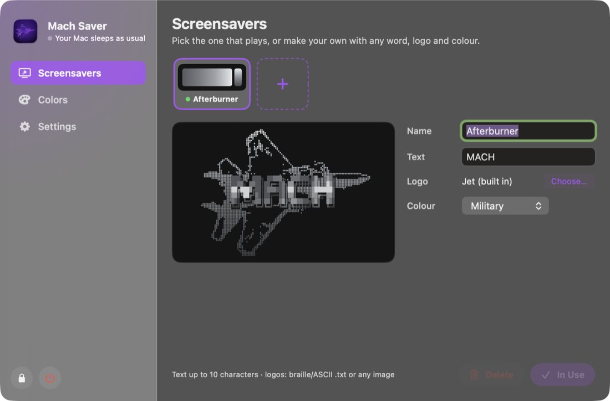

# mach-saver

Screensavers for **MACH**, my macOS desktop setup. It's the sibling of
[mach-boot](https://github.com/Christianships/mach-boot): mach-boot plays at
login, mach-saver plays while you're away.

**Mach Saver** is a menu bar app that works like Amphetamine, but only when it
matters: it keeps your Mac awake while an agent (Claude Code, Codex, Gemini, …)
is actually working and, once you step away, covers the screen with your
screensaver. Any key or mouse move brings you back. With no agent working, your
Mac sleeps and locks as usual.


*`afterburner`: a braille jet filling the screen with MACH in large letters
across its middle. Like Omarchy's screensaver, MACH plays one
[terminaltexteffects](https://github.com/ChrisBuilds/terminaltexteffects)-style
effect after another at random: decrypt, beams, rain, slide, expand,
scattered, middle-out, print, unstable, burn, waves, matrix, spray, crumble
and sweep.*

## Quick start

```sh
make install          # build, copy to ~/Applications, link the mach-saver command
mach-saver show       # show the screensaver now
```

- **Click the jet in the menu bar** for a quick menu: your screensavers and
  colours (with swatches) to switch in one click, **Settings…** (⌘,) for the
  panel, and Quit. The jet is solid while it's keeping your Mac awake, faded
  otherwise.
- **Open Mach Saver** from Spotlight or Finder for the panel too.
- **Super+|** in AeroSpace shows the screensaver:

  ```toml
  ctrl-shift-backslash = 'exec-and-forget open -g mach-saver://show'
  ```

## The panel



A floating panel (styled after [MouseSkins](https://github.com/Christianships/MouseSkins))
in the middle of the screen, with a sidebar:

- **Screensavers**: your saved screensavers, each with its own word (MACH, or
  anything up to 10 characters, drawn in block letters), logo (the jet, a
  braille/ASCII `.txt` like the fastfetch ones, or any image, turned into
  dots) and colour, with a live preview. `+` makes a new one; **Use** picks
  the one that plays.
- **Colors**: Purple, Military (mach-boot's camo grays), Classic Fire and
  Mono, plus your own. `+` copies the selected one into an editable
  colourway: background, jet gradient, text gradient and camo.
- **Settings**: keep awake (while agents work / always / off), how long
  you're away before the screensaver shows, launch at login. Lock and Quit
  sit at the bottom of the sidebar.

Everything saves as you go, to
`~/Library/Application Support/Mach Saver/library.json`. Esc or clicking
elsewhere closes the panel. `MachSaver --panel --page colors` opens it on a
page.

## Commands

| Command | What it does |
|---|---|
| `mach-saver show` | Show the screensaver now |
| `mach-saver start` | Start a session: screensaver up and Mac awake, agents or not, until you dismiss it |
| `mach-saver stop` | End the session |
| `mach-saver toggle` | Start or end a session |
| `mach-saver list` | List your saved screensavers; `*` marks the one that plays |
| `mach-saver use <name>` | Play a saved screensaver, by name |

## How it decides

The screensaver only comes up two ways:

1. **You call it**: `mach-saver://show` (the AeroSpace binding) or
   `mach-saver show`/`start`. It stays up, and your Mac awake, until you come
   back and dismiss it. Opening the app or clicking the menu bar icon never
   shows it.
2. **An agent is working and you've stepped away**: every 10 seconds it looks
   for processes started as one of `agentNames`
   (`defaults read com.christianaguilar.mach-saver agentNames`) and checks
   whether they're busy: using 4% or more of a core, counting the tools and
   builds they've started. An agent sitting idle at its prompt uses about 1-2%.
   While one is working (and for 90 seconds after, to ride out pauses) it holds
   a `PreventUserIdleDisplaySleep` assertion, like `caffeinate -d`. After the
   away delay (default 2 minutes) with no keyboard or mouse input, the
   screensaver covers every display, and resets macOS's idle timer while it's
   up so the system screen saver doesn't start on top.

Otherwise it holds nothing, so macOS sleeps and locks as usual even with agent
windows open. When the agents finish, it takes the screensaver down and lets
go. While it's keeping you awake your Mac won't auto-lock: use Lock in the
panel (or Ctrl-Cmd-Q) when you walk away.

## Resource use

- **In the menu bar:** checks in every 5 seconds and scans agents every 10
  (about 2 ms a scan; each process's arguments are read once). Near 0% CPU.
- **Screensaver up:** draws from the display's refresh at up to 30fps (about
  2.5 ms a frame) and stops drawing when the display sleeps. Its full-screen
  windows are closed, not just hidden, when you come back, so their memory is
  freed.
- **The panel** is its own short-lived process (`MachSaver --panel`) that
  quits when it closes, so the menu bar app never loads SwiftUI. The two talk
  over distributed notifications.

## Icons

- The app icon is the afterburner jet in deep purple dots on a dark violet
  tile, drawn by `Icon/make-icon.swift`; `make icon` rebuilds
  `Icon/AppIcon.icns`.
- The menu bar icon is the same jet in silhouette (`App/MenuIcon.swift`),
  rendered into 1x/2x template bitmaps so macOS tints it for the menu bar.

## Screensaver scenes (code)

Saved screensavers are variations of a scene. A new kind of scene is a folder
under `screensavers/`:

```
screensavers/<name>/
  <Name>.swift      a ScreensaverView subclass + a static `screensaver`
  *.txt, *.png …    assets, bundled into Resources/<name>/
```

1. Subclass `ScreensaverView`: override `advance(_ dt:)` to step the animation
   and `draw(_:)` to render it. The app handles windows, timing and dismissal.
2. Give it a `static let screensaver = Screensaver(id:title:make:options:)`.
3. Add it to `Screensavers.all` in `App/Screensaver.swift`.
4. `make snapshot` renders `docs/<name>.png` to check it without taking over
   the screen.

### Afterburner

- The jet is `screensavers/afterburner/jet.txt`, braille generated from
  `tools/jet-source.png` with `make jet`. The same file is my fastfetch logo.
- `TextEffects.swift` has the text effects; `AFTERBURNER_EFFECT=<name>`
  starts on a given one (handy with `--snapshot`).
- `Library.swift` has the saved screensavers and colourways, the block
  letters for custom words, and image-to-dots for custom logos.
