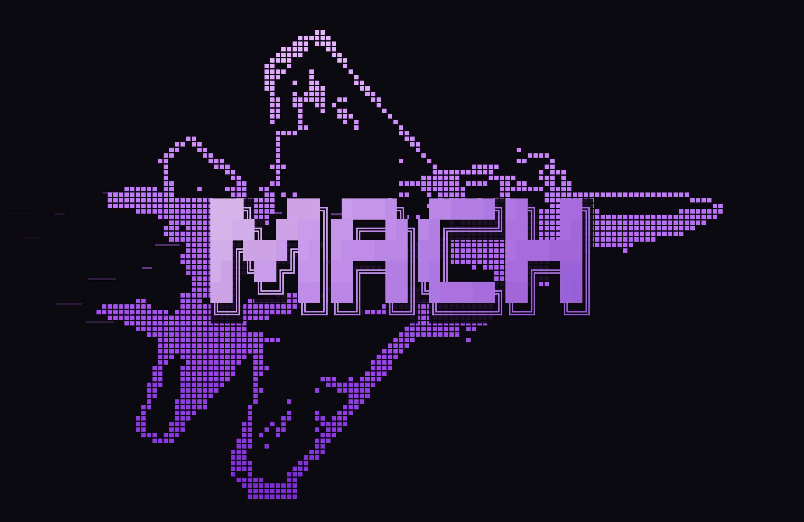

# mach-saver

Screensavers for **MACH**, my macOS desktop setup. It's the sibling of
[mach-boot](https://github.com/Christianships/mach-boot): mach-boot plays at
login, mach-saver plays while you're away.

**Mach Saver** is a menu bar app that works like Amphetamine. It keeps your Mac
awake while an agent session (Claude Code, Codex, Gemini, …) is running and,
once you step away, covers the screen with the active screensaver. Any key or
mouse move brings you back.



*`afterburner`: a braille jet filling the screen with MACH in large letters
across its middle. Like Omarchy's screensaver, MACH plays one
[terminaltexteffects](https://github.com/ChrisBuilds/terminaltexteffects)-style
effect after another at random: decrypt, beams, rain, slide, expand,
scattered, middle-out, print, unstable, burn, waves, matrix, spray, crumble
and sweep. `AFTERBURNER_EFFECT=<name>` starts on a given one.*

## Quick start

```sh
make install          # build, copy to ~/Applications, link the mach-saver command
mach-saver show       # show the screensaver now
```

Opening **Mach Saver** from Spotlight or Finder starts a session: it stays awake
and shows the screensaver straight away.

## Commands

| Command | What it does |
|---|---|
| `mach-saver show` | Show the screensaver now |
| `mach-saver start` | Start a session: stay awake + screensaver, agents or not |
| `mach-saver stop` | End the session |
| `mach-saver toggle` | Start or end a session |
| `mach-saver list` | List screensavers; `*` marks the active one |
| `mach-saver use <name>` | Switch the active screensaver |

The same things are in the flame menu, plus keep-awake mode, idle delay, lock
screen, launch at login, and each screensaver's own settings.

In AeroSpace I bind it to Super+|:

```toml
ctrl-shift-backslash = 'exec-and-forget open -g mach-saver://show'
```

## How it decides

- Every few seconds it looks for processes started as one of `agentNames`
  (`defaults read com.christianaguilar.mach-saver agentNames`).
- While one is running, or a session is on, it holds a
  `PreventUserIdleDisplaySleep` assertion, like `caffeinate -d`.
- After `idleMinutes` (default 2) with no keyboard or mouse input, the
  screensaver covers every display. While it's up it resets macOS's idle timer
  so the system screen saver doesn't start on top.
- When the agents exit (and no session is on) it lets go, and macOS sleeps and
  locks as usual.

While it's keeping you awake your Mac won't auto-lock. Use Lock Screen in the
menu (or Ctrl-Cmd-Q) when you walk away.

## Adding a screensaver

Each screensaver is a folder under `screensavers/`:

```
screensavers/<name>/
  <Name>.swift      a ScreensaverView subclass + a static `screensaver`
  *.txt, *.png …    assets, bundled into Resources/<name>/
```

1. Subclass `ScreensaverView`: override `advance(_ dt:)` to step the animation
   and `draw(_:)` to render it. The app handles windows, timing and dismissal.
2. Give it a `static let screensaver = Screensaver(id:title:make:options:)`.
3. Add it to `Screensavers.all` in `App/Screensaver.swift`.
4. `make snapshot` renders `docs/<name>.png` to check it without taking over the screen.

## Afterburner

- The jet is `screensavers/afterburner/jet.txt`, braille generated from
  `tools/jet-source.png` with `make jet`. The same file is my fastfetch logo.
- Its menu has Fire Color (Purple, Classic Fire, Mono) and Logo, which takes
  any fastfetch-style text logo (braille or ASCII; `$1` colour markers are ignored).
