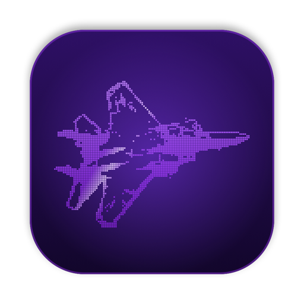

  

  
  

<h1 align="center">Mach Saver</h1>

Keeps your Mac awake while AI agents work, and shows a screensaver while you're away.

  

## Install

Needs an Apple Silicon Mac on macOS 14+ with the Xcode command line tools
(`xcode-select --install`).

1. Download and unzip this repo.
2. In the folder, run `make install`. It installs Mach Saver to `~/Applications`.
3. Open **Mach Saver** from Spotlight.

## Use

- While an agent (Claude Code, Codex, Gemini…) is working, your Mac stays awake.
  Step away and the screensaver comes up. Any key or mouse move brings you back.
- With no agent working, your Mac sleeps and locks as usual.
- **Click the jet** in the menu bar to switch screensavers and colors, or open
  **Settings…** to make your own.

---

⭐ If Mach Saver kept your agents running, <a href="https://github.com/Christianships/mach-saver">star the repo</a>.

